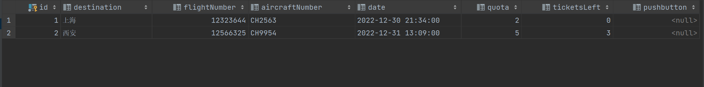

## 实验内容

航空机票订票系统设计

（1）设计每条航线所涉及的信息，如终点站名、航班号、飞机号、飞机周日（星期几）、乘员定额、余票量、订定票的客户名单（包括姓名、订票量、舱位等级 1，2 或 3）等；

（2）结合基本操作的单链表、队列、二叉树等数据结构以及排序算法，设计机票系统的查询、订票、退票等功能；

（3）设计并实现人机交互友好的界面或菜单。

## 实验方案

1.设计界面

根据实验要求设计有登陆界面、乘客查看航班界面、乘客购票界面、乘客查看“我的订单”界面、乘客退票界面、管理员查看航班界面、管理员查看航班乘客名单界面等七个界面。

2.确定使用C++语言，利用Qt进行实现，数据采用数据库MySQL储存，利用tableView显示在界面中；对航班的“购票”、“退票”等操作通过在tableView中加入控件来实现；界面的具体设计利用Qt的ui进行设计。

3.对数据库的操作用到QSqlQuery类加sql语句，Qt中不会对sql语句做检查，需要在运行测试时结合数据库内容进行操作结果的确认，可以利用数据库图形化软件如DataGrip来方便查看。

4.界面的设计力求简洁美观。

5.需要做到仅对数据库进行修改程序能自动添加相应的控件来适应数据的改变。

6.当在程序内对数据进行操作的时候，确认时应立即刷新之前界面的数据，并重新设置控件状态。

## 流程图或类图

程序CPP文件（同类名）

## 难点及其解决方法

**难点1**：需要根据数据的数量对每一条航线都自动增设一个“购买”和“退票”等按键，对于每个按键要在点击后新建一个界面并在数据修改后重置这个按键的状态，要在子窗口修改主窗口的控件是一个难点。

解决方法：查找发现ui-\>tableView-\> indexWidget(QModelIndex index)可以得到对应坐标的控件的指针，而点击的控件的坐标可以通过ui-\>tableView-\>selectionModel()-\>currentIndex()得到，同时可以通过QSqlRecord类记录该行的数据用于后续操作。

**难点2**：在调试过程中在connect语句的lambda表达式中对数据库进行操作的sql语句中频繁出现Segmentation fault。

解决方法：查询发现这是由于connect语句会自动生成多线程，从而导致了对数据库进行操作的段错误，将lambda表达式替换为槽函数即可。

**难点3：**界面间传参

解决方法：查询资料的得知界面传参可以通过在主窗口发送信号，子窗口通过槽函数接收来实现，但除此之外还有更简单的方法，那就是在主界面将需要传递的参数设为全局变量，在子窗口通过extern关键字来获得参数。

## 程序测试

**1、登陆界面**

**2、乘客查看航班信息界面（点击乘客登录）**

**若航班机票售罄则购票按钮锁定。**

**·附数据库航班信息图片**

**3、购票界面**

**·购买后航班信息界面刷新**

**·数据库刷新（航班信息表）**

**·数据库刷新（乘客名单表）**

**4、“我的订单”界面**

**5、退票界面**

**·退票后“我的订单”界面刷新**

**·航班信息界面刷新**

**·数据库刷新（航班信息表）**

**·数据库刷新（乘客名单表）**

**6、管理员登陆界面**

**·管理员信息输入错误显示**

**7、管理员查看航班信息界面**

**8、管理员查看乘客信息界面**

